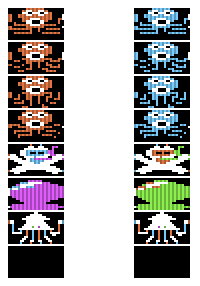

# The Octopus

* Author: Shinji Minamiyama (南山 真爾)
* Publisher: micomBASIC (マイコン BASIC)
* Date: [1985-08,
  pp. 154-155](https://archive.org/details/micomBASIC-1985-08/page/154/mode/1up)
* Typed in by: @eientei on the applesaucefdc Discord server
* Translations: [Google Translate](http://translate.google.com)

## Overview

From the author:

> It's sooooooooooooooooooooo! On March 26, I went to Akihabara to buy
> an Apple IIc while visiting a relative's house.

This is a basic arcade-style action game. The player is a cat who
drops pots to catch an octopus. The cat dies if the octopus touches
it. There is also a cuttlefish that comes out that the cat can eat for
500 bonus points.

This is a port of the VIC-1001 version of "The Octopus" from the
August 1983 issue of micomBASIC. It uses code inspired by:

*   `THE NUTON` by Yasushi Aida (相田 泰志氏) in the May 1984 issue.
*   `LORES RUNNER` by Mitsuo Takahashi (高橋 光雄氏) in the September
    1984 issue.
*   `THE OCTOPUS POT` in the August 1983 issue.

(Unfortunately, none of these issues have been scanned, as far as I
can tell. `THE OCTOPUS POT` seems to be by the same author.)

## How to Play

From the article:

> The key operation is `A`, `Z`, `<`, `>` to move the cat
> up/down/left/right, `SPACE` to drop the pot.

A level is over when all of the octopuses have been caught. Levels
come in batches of three with an octopus added in each level in the
batch.

If the cat is touched three times, the game is over.

### Running

In an emulator, boot `octopus.dsk`.

### Typing

To "type in" the code on an emulator:

0.  Ensure that you are booted in to DOS or ProDOS with
    `BASIC.SYSTEM`.
1.  Copy and paste `octopus.bas` into the emulator. There are no spaces
    between the `REM`/`DATA` statements and what follows because
    AppleSoft stores what follows as bytes, including any white
    space. When listing, the `REM`/`DATA` statements will
    automatically have a space inserted afterwards. Therefore, if you
    enter a space during input, there will be _two spaces_.
2.  Save the program as `octopus` if you would like:
    ```none
	SAVE OCTOPUS
	```
3.  Run the game:
    ```none
	RUN
	```

## BASIC

The BASIC program is divided into several parts:

*   [initialization](#initialization) (lines 10-50)
*   [title screen](#title-screen) (lines 60-100)
*   [game loop](#game-loop) (lines 110-360)
*   [pot movement](#pot-movement) (lines 400-470)
*   [cuttlefish movement](#cuttlefish-movement) (lines 500-560)
*   [finish level](#finish-level) (lines 700-790)
*   [cat caught](#cat-caught) (lines 800-880)
*   [game over](#game-over) (lines 900-960)
*   [binary data loading](#binary-data-loading) (lines 5000-5040)
*   [sound maker](#sound-maker) (lines 6000-6040)
*   [background drawing](#background-drawing) (lines 6500-6580)

### Initialization

The initialization at the start of the program is pretty simple:

```basic
10 HOME:HTAB 5:VTAB 10:PRINT "WAIT......";CHR$(7)
20 GOSUB 5000
30 HGR:GOSUB 6500
40 S=0:R=1:N=2:HOME
50 POKE 770,16:POKE 771,4:POKE 769,80:POKE 773,97
```

After clearing the screen and printing "WAIT......", the program calls
the [binary data loading](#binary-data-loading) routine, then the
[background drawing](#background-drawing) routine.

It sets the following global variables:

*   `S`: Score.
*   `R`: Current level.
*   `N`: Number of cats left, not including current cat.

Line 50 sets up the graphics routine to draw sprites that are 16
pixels high and 4 bytes wide. It also sets the high byte of the sprite
address.

### Title screen

The first line prints the title and instructions and plays a tune:

```basic
60 VTAB 22:HTAB 15:PRINT "THE OCTOPUS":VTAB 24:HTAB 12:PRINT "HIT 'S' TO START.":GOSUB 6040
```

The next lines make the cuttlefish go from left to right across the
screen until `S` is pressed:

```basic
70 FOR I=0 TO 36:POKE 768,I:POKE 772,128:CALL 784
80 POKE -16368,0:IF PEEK(-16384)=83 THEN I=36:NEXT:GOSUB 6000:GOTO 100
90 FOR L=0 TO 200:NEXT:POKE 772,192:CALL 784:NEXT:GOTO 70
```

Note that the first poke (`POKE 768,I`) sets the X position, the
second (`POKE 772,128`) sets the sprite to the cuttlefish. The third
poke (`POKE 772,192` on line 90, after the delay loop) clears the
cuttlefish.

Finally, the cuttlefish is removed and the current stats (score, etc.)
are printed at the bottom of the screen.

```basic
100 POKE 772,192:CALL 784:HOME:VTAB 21:PRINT "SCORE:"S;:HTAB 20:PRINT "HIGH-SCORE:"HS:VTAB 22:PRINT " CATS:"N;:HTAB 25:PRINT "STAGE:"R
```

### Game loop

The game loop uses several arrays that have 3 elements:

array | purpose
-----:|--------
`T()` | Octopus caught flag (0 = caught, 1 = not caught)
`X()` | Octopus X position (initialized to 18)
`Y()` | Octopus Y position (initialized to 120)
`C()` | Octopus steps in current direction (integer in 0-7, initialized randomly)
`D()` | Direction the octopus is moving (0-7, initialized to the index)

as well as several global variables:

variable | purpose
--------:|--------
`E`      | Is a cuttlefish on the screen? (initialized to 0)
`EX`     | Cuttlefish X position
`EY`     | Cuttlefish Y position
`C`      | Is a pot being dropped? (initialized to 0)
`CX`     | Pot X position
`CY`     | Pot Y position
`X`      | Cat X position (initialized to 18)
`Y`      | Cat Y position (initialized to 24)
`T`      | Number of octopuses - 1 (initialized to (`R`+2) mod 3)
`B`      | Number of caught octopuses this level
`M`      | ??? (sequence: 1, 2, 0, 1, 2, 0,...)

Lines 110-120 initialize the arrays as well as the variables:

```basic
110 FOR I=0 TO 2:T(I)=1:NEXT:E=0:C=0:X=18:Y=24:T=R+2-INT((R+2)/3)*3
120 FOR I=0 TO 2:X(I)=18:Y(I)=120:D(I)=I:C(I)=INT(RND(1)*8):NEXT
```

Line 130 prints the current score. (Note that `PRINT S` has to be
entered as `PRINTS` for it to come out right.)

```basic
130 VTAB 21:HTAB 7:PRINTS
```

Line 140 clears the cat at its current position:

```basic
140 POKE 772,192:POKE 773,97:POKE 768,X:POKE 769,Y:CALL 784
```

Lines 150-170 read a character from the keyboard, clear the strobe,
then move the cat and draw it. The fancy math looks good, but it is
probably slower than `IF` statements in AppleSoft because of all of
the floating point arithmetic.

```basic
150 A=PEEK(-16384):POKE -16368,0
160 X=X-(A=172 AND X>0)*2+(A=174 AND X<36)*2
170 Y=Y-(A=193 AND Y>8)*8+(A=218 AND Y<112)*8
180 POKE 772,0:POKE 768,X:POKE 769,Y:CALL 784
```

One thing to note is that the X coordinate is always even so that the
program doesn't have to worry about the odd/even byte color
differences.

Lines 190-290 move the octopuses:

```basic
190 B=0
200 M=(M<3)*(M+1)
210 FOR I=0 TO T
220 IF T(I)=0 THEN B=B+1:GOTO 290
230 POKE 768,X(I):POKE 769,Y(I):POKE 772,192:POKE 773,97:CALL 784
240 X(I)=X(I)-((D(I)=0 OR D(I)=7 OR D(I)=6) AND X(I)>0)*2+((D(I)=2 OR D(I)=3 OR D(I)=4) AND X(I)<36)*2
250 Y(I)=Y(I)-((D(I)=9 OR D(I)=1 OR D(I)=2) AND Y(I)>8)*8+((D(I)=6 OR D(I)=5 OR D(I)=4) AND Y(I)<120)*8
260 D(I)=(C(I)=0)*INT(RND(1)*8)+(C(I)>0)*D(I):C(I)=(C(I)>0)*(C(I)-1)+(C(I)=0)*INT(RND(1)*8)
270 POKE 768,X(I):POKE 769,Y(I):POKE 772,M*64:POKE 773,96:CALL 784
280 IF ABS(X(I)-X)<4 AND ABS(Y(I)-Y)<16 THEN 800
290 NEXT
```

Line 190 clears the count of caught octopuses. Line 200 determines
which of the three octopus sprites will be drawn next.

Line 210 is the main loop that cycles through each octopus for the
level using `I`.  In line 220, if `T(I) = 0`, then the octopus has
been caught, so we skip it and go through the loop again.

Lines 230-270 actually move the octopus. Line 230 erases the octopus,
then line 270 draws it in the new position. To calculate the new
position, the game chooses a direction, `D(i)`, and a distance `C(I)`,
that the octopus should move.  The directions are:

value | direction
-----:|:---------
    0 | left
    1 | up
    2 | right,up
    3 | right
    4 | right,down
    5 | down
    6 | left,down
    7 | left
   9? | up

It's clear that there's a bug here. `D(I)` is assigned a new value
from 0-7 on line 260, so the `9` on line 250 should probably be a `0`.
This would make more sense as `0` would mean "left, up" and all
directions would be represented.

The extra conditions in the formulas keep the octopus on the screen.

Line 260, as mentioned above, sets `D(I)` to a new direction when
`C(I) = 0`.  `C(I)` is set to `C(I) - 1`, or, if it is zero, is set to
a number from 0-7, representing the number of steps the octopus will
take in the new direction. Note that if `C(I)` is set to `0`, the
octopus will still take one step.

Line 270 draws the octopus on the screen.

Line 280 detects whether the octopus has touched the cat. If it has,
control goes to the [cat caught](#cat-caught) routine.

Finally, line 290 starts everything for the next octopus, if there is
one.

The next section tests several conditions at the end of the main loop:

```basic
300 IF B=T+1 THEN 700
310 IF A=160 AND C=0 THEN C=1:CX=X:CY=Y+16:GOSUB 6020
320 IF C=1 THEN GOSUB 400
330 IF INT(RND(1)*100)=0 AND E=0 THEN E=1:EX=0:EY=80
350 IF E=1 THEN GOSUB 500
360 GOTO 140
```

Line 300 tests whether the level is over and, if so, goes to the
[finish level](#finish-level) routine.

Line 310 tests whether the space bar has been pressed and, if so, drops
a pot. Line 320 actually [moves the pot](#pot-movement).

Line 330 decides whether a cuttlefish should appear. There is about a
1% chance every time through the loop. Line 350 actually [moves the
cuttlefish](#cuttlefish-movement).

Line 360 starts the loop all over again.

### Cuttlefish movement

This short routine moves the cuttlefish in a random zig-zag pattern:

```basic
500 POKE 768,EX:POKE 769,EY:POKE 772,192:POKE 773,97:CALL 784
510 EX=EX+1:IF EX=37 THEN E=0:RETURN
520 A=INT(RND(1)*2)
530 EY=EY-(A=0 AND EY>8)*4+(A=1 AND EY<120)*4
540 IF ABS(EX-X)<4 AND ABS(EY-Y)<16 THEN GOSUB 6010:S=S+500:HTAB 7:VTAB 21:PRINTS:E=0:RETURN
550 POKE 768,INT(EX):POKE 769,EY:POKE 772,128:CALL 784
560 RETURN
```

Line 500 erases the cuttlefish. Line 510 just removes the cuttlefish
if it makes it to the right side of the screen.

Line 520 choose `0` or `1` randomly. Line 530 causes the cuttlefish to
up on `0` and down on `1`.

Line 540 checks to see if the cat caught the cuttlefish and, if it
did, adds 500 to the score, and returns.

Line 550 draws the cuttlefish. Line 560 returns.

### Pot movement

Pot movement is also pretty simple since the pot just falls in a
column. The most complicated part is the loop at lines 450-470 that
checks to see if the pot hit any of the octopuses. Note that the pot
has to hit the octopus directly on the head.

```basic
400 POKE 768,CX:POKE 769,CY:POKE 772,192:POKE 773,97:CALL 784
410 POKE 775,40:POKE 776,20:CALL 880
420 CY=CY+8
430 POKE 769,CY:POKE 772,64:CALL 784
440 IF CY>132 THEN C=0:RETURN
450 FOR I=0 TO T:IF T(I)=0 THEN 470
460 IF X(I)=CX AND ((Y(I)=CY+16) OR (Y(I)=CY+8)) THEN GOSUB 6030:S=S+50:HTAB 7:VTAB 21:PRINTS:T(I)=0
470 NEXT:RETURN
```

### Finish level

When the level is finished, the game plays a victory sound, then
increments the player's score by ten 100 time, beeping each time.
This is a classic video game trope, but is super annoying because it
takes such a long time.

```basic
700 GOSUB 6040
710 FOR I=0 TO 1000:NEXT
720 FOR I=1 TO 100:S=S+10
730 POKE 775,100:POKE 776,100:CALL 880
740 HTAB 7:VTAB 21:PRINT S:NEXT
750 FOR I=0 TO 3000:NEXT
760 HOME:VTAB 22:HTAB 5:PRINT CHR$(7)"LET'S GO NEXT STAGE!!!"
770 FOR I=8 TO 151:HCOLOR=0
780 HPLOT 0,I TO 279,I:NEXT
790 GOSUB 6000:R=R+1:GOTO 100
```

Note that lines 770-780 clear the screen.

### Cat caught

The main point of this routine is to show a death animation, which
consists of the cat sprite alternating with the first octopus sprite
while some burbling noise happens.  The effect is pretty good.

```basic
800 POKE 776,5:POKE 768,X:POKE 769,Y
810 FOR I=0 TO 100
820 POKE 772,0:POKE 773,96:CALL 784
830 POKE 775,INT(RND(1)*32):CALL 880
840 POKE 773,97:CALL 784
850 NEXT:X=18:Y=24
860 N=N-1:IF N=-1 THEN 900
870 FOR I=8 TO 151:HCOLOR=0:HPLOT 0,I TO 279,I:NEXT
880 HTAB 7:VTAB 22:PRINT N:GOTO 120
```

The flickering happens because the loop from lines 810 to 850 is
pretty tight. The `POKE` and `CALL` on line 830 cause the random
burbling sound.  The rest of line 850 puts the cat back at the top
center of the screen.

Line 860 checks to see if all of the cats have been used up, and if
they have, goes to the game over screen.

### Game over

The game over routine is fairly simple.  After the death animation,
the game prints "GAME OVER!!!!" and asks if the player wants to play
again. If they do, the screen is cleared and the game starts again at
line 40.

```basic
900 VTAB 22:PRINT "GAME OVER!!!!":FOR I=0 TO 2000:NEXT
910 IF S>HS THEN GOSUB 6030:GOSUB 6010:PRINT CHR$(7):HS=S:HTAB 31:VTAB 21:PRINT HS
920 HTAB 14:VTAB 24:PRINT "TRY AGAIN?";:GET A$
930 IF A$="N" THEN TEXT:HOME:END
940 IF A$<>"Y" THEN 920
950 FOR I=8 TO 151:HCOLOR=0:HPLOT 0,I TO 279,I:NEXT
960 GOTO 40
```

### Binary data loading

```basic
5000 FOR I=0 TO 447:READ A:POKE I+24576,A:NEXT
5010 FOR I=0 TO 63:POKE I+25024,0:NEXT
5020 FOR I=784 TO 875:READ A:POKE I,A:NEXT
5030 FOR I=880 TO 895:READ A:POKE I,A:NEXT
5040 RETURN
```

This routine loads binary data into four memory regions:

name     | addr (dec) | addr (hex) | len (dec)
---------|-----------:|-----------:|----------:
sprites1 |      24576 |      $6000 |      448
sprites2 |      25024 |      $61C0 |       64
display  |        784 |       $310 |       92
tone     |        880 |       $370 |       15

The display and tone routines are exactly the same as those used in
[The Active Balls](../active_balls), so see the disassembly there to
understand how they work.

The sprites look like:



The first column contains all the sprites drawn on an even byte
boundary while the second column shows the same sprites drawn on an
odd byte boundary.  From this, it's pretty clear that the program only
draws on even byte boundaries.

Note that the blank sprite at the bottom is created by line 5010.

### Sound maker

This section is really not one routine, but a collection of routines
that make different sounds for the game.  Each routine is exactly one line long:

```basic
6000 POKE 775,20:FOR I=255 TO 1 STEP -1:POKE 776,I:CALL 880:NEXT:RETURN
6010 POKE 775,70:FOR I=100 TO 40 STEP -10:POKE 776,I:CALL 880:NEXT:RETURN
6020 POKE 775,5:FOR I=255 TO 20 STEP -10:POKE 776,I:CALL 880:NEXT:RETURN
6030 POKE 775,200:POKE 776,80:CALL 880:POKE 776,120:CALL 880:POKE 776,50:CALL 880:RETURN
6040 POKE 775,40:FOR I=8 TO 3 STEP -1:FOR L=0 TO 5:POKE 776,L+I*20:CALL 880:NEXT:NEXT:RETURN
```

You can hear what they sound like by calling them from the basic
prompt, like:

```basic
GOSUB 6000
```

line | sound
----:|--------------------
6000 | long, rising
6010 | short, rising sparkle
6020 | medium, rising buzz
6030 | medium, 3-tone computer bleep
6040 | long, rising/falling

### Background drawing

The background of waves and the ground is drawn by a short piece of
code:

```basic
6500 FOR I=0 TO 278
6510 HCOLOR=7:A=SIN((I-INT(I/12)*12)/4)*4
6520 HPLOT I,A+3
6530 HCOLOR=6
6540 HPLOT I+1,A+4
6550 HCOLOR=5
6560 HPLOT I,159 TO I,INT(RND(1)*4)+153
6570 NEXT
6580 RETURN
```

This progresses left to right across the screen. The waves are drawn
by the sin() function and the ground is drawn by random lines from 3-6
pixels in height. The wave function creates a very nice effect.

This routine is not very efficient because it relies on lots of
floating-point operations for every column of pixels on the
screen. Not only that, but half of the columns can't display orange,
so the calculations are wasted.
